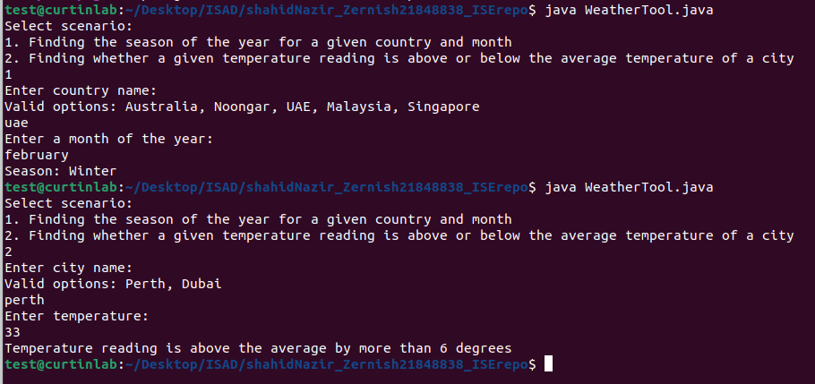

# Cover page [in progress]

# Introduction [in progress]

# Module descriptions

#### SeasonModule:

#### Submodule validateInput

- **Imports:** country, month (strings) provided by user
- **Exports:** None
- **Description:** Validates the input provided by the user for determining the season of the year and checks if the provided country and month are valid inputs.

#### Submodule findSeason

- **Imports:** country, month (strings) provided by user
- **Exports:** season (string) determined by the module
- **Description:** Determines the season of the year based on the country name and month provided by the user. If the provided country and month are valid, the module returns the corresponding season.

#### TemperatureModule:

#### Submodule validateInput

- **Imports:** city (string), temperature (double) provided by user
- **Exports:** None
- **Description:** Validates the input provided by the user for analysing the temperature of a city and checks if the provided city name and temperature reading are valid inputs.

#### Submodule compareTemperature

- **Imports:** city (string), temperature (double) provided by user
- **Exports:** message (string) message generated by the module based on the temp analysis
- **Description:** Compares a given temperature reading with the average temperature of a city and generates an appropriate message. If the temperature reading is within the valid range for the city, the module compares it with the average temperature of the city and generates appropriate response.

#### Submodule getDailyMeanTemperature 
- **Imports:** city (string) provided by user 
- **Exports:** dailyMeanTemperature (double) determined by the module 
- **Description:** Retrieves the daily mean temperature based on the city name provided by the user.

#### Design decisions and modularity

I created two modules, one for each scenario and further divided each module into two submodules.
#### SeasonModule:

- Divided into two modules, validateInput and findSeason, to avoid problems and promote reusability.
- Ensures that each module has a single responsibility, making it easier to understand and maintain.

#### TemperatureModule:

- Also divided into two modules, validateInput and compareTemperature.
- Allows for better organization and clarity in the code.

#### Modularity Principles:

- **Divide and Conquer:** Dividing the functionality into smaller modules facilitates easier development, testing, and maintenance. Each module focuses on a specific task, promoting clarity and reducing complexity.
- **High Cohesion:** Each module performs a single well-defined task, enhancing clarity and reducing the likelihood of bugs. Promotes code reuse and makes it easier to update or modify specific functionalities without affecting others.
- **Low Coupling:** Modules communicate through well-defined interfaces (Imports and Exports), reducing interdependencies. Changes in one module are less likely to impact others, promoting flexibility and maintainability. By having the functionality separated into different classes, I’ve reduced the coupling between them.
- **Input Handling and Output Availability:** When handling inputs, modules validate input data to ensure that only valid inputs are processed further. Error handling is implemented to handle invalid inputs and provide meaningful feedback to the user. As for the outputs, each module exports relevant data or messages, making them available for further processing or display.
- **The structure allows for easy extension or modification of functionalities throughout the project. New modules can be added or existing ones modified without affecting the overall system.** 

# Modularity
#### How to run code with correct commands 
-	Compile the code “javac WeatherTool.java”
-	Execute, run the WeatherTool program “java WeatherTool”
-	Follow the prompts; choosing between scenario 1 and 2 
-	Depending on the scenario chosen, the program will provide information about the season for a given country and month, or whether a temperature reading is above or below average for a city.

#### Sample output of running production code

#### brief explanation on application of modularity concepts 
-	My code applies modularity concepts, including low coupling and high cohesion. Low coupling is achieved by making sure that the modules are loosely connected, meaning changes in one module would minimally impact the others, which creates a more flexible and easily maintainable code. 
-	My code maintained high cohesion by grouping related functionalities with each module, separating them between the two given scenarios. Therefore my code has a modular design and is maintainable and scalable. 

#### Checklist Review Results 
| Item | Checklist question related to modularity | Yes/No | Description of the issue if No is the answer |
|------|-------------------------------------------|--------|----------------------------------------------|
| 1    | Does code exhibit low coupling between modules? | Yes |                                                 |
| 2    | Are cross-module function dependencies minimised? | Yes |                                             |
| 3    | Are global variables avoided? | Yes |                                                                |
| 4    | Control flags used appropriately? | Yes |                                                                |
| 5    | Are parameters received in correct order? | Yes |                                                             |
| 6    | Is a tolerance value used when comparing real numbers for equality? | Yes |                                            |
| 7    | Does each method clearly person a single task? | Yes |                                                             |
| 9    | Is redundancy minimised? | No | There are similarities in the validation part for the methods in TemperatureModule |

#### Refactoring Decisions 
Generally, my code shows good modularity practices. It demonstrates low coupling between modules, minimised dependencies between modules, and avoidance of inconvenient global variables. Each method performs a single task, enhancing clarity and maintainability. However, the review of the checklist highlighted the main issue related to code redundancy. Specifically there were similarities in the validation part for the methods in the TemperatureModule class, indicating potential redundancy. 

To address the issue of redundancy, I refactored the ‘TemperatureModule’ class to reduce the duplication of code. Previously both the ‘validateTemperature’ and ‘compareTemperature’ methods had similar logic to assign the daily mean temperature based on the city. This duplication was removed by introducing a new private method ‘getMeanTemperature’.

This method separated the logic for retrieving the daily mean temperature based on the city name, to a separate method. Both ‘validateTemperature’ and ‘compareTemperature’ now call this other method to get the daily mean temperature, reducing redundancy and making the code easier to maintain. By refactoring the code in this way, I ensured that if the logic for determining the daily mean temperature needs to be changed in the future, it only needs to be updated in one place (getDailyMeanTemperature method) rather than in multiple places, reducing confusion and errors. 
Finally, I revised module descriptions to add the new method.

# Test design- Black-box test cases

####** Equivalence Partitioning** 

#### Submodule: validateInput

| Category                           | Test Data                   | Expected result |
|------------------------------------|-----------------------------|-----------------|
| Valid country and valid month combination   | country = "Australia", month = "January"  | true            |
| Valid country and invalid month combination | country = "Australia", month = "InvalidMonth" | false           |
| Invalid country and valid month combination | country = "InvalidCountry", month = "January" | false           |
| Invalid country and invalid month combination | country = "InvalidCountry", month = "InvalidMonth" | false        |

#### Submodule: findSeason

| Category                           | Test Data                   | Expected result |
|------------------------------------|-----------------------------|-----------------|
| Valid country and valid month combination   | Country = "Australia", Month = "January"  | Season = "Summer" |
| Valid country and invalid month combination | Country = "Noongar", Month = "July" | Season = "Invalid input message" |
| Invalid country                     | Country = "Nazir"           | Prompt for country again |

#### Submodule: validateTemperature

| Category                           | Test Data                   | Expected result |
|------------------------------------|-----------------------------|-----------------|
| Valid City && valid temperature   | City = "Perth", Temperature = 20.0  | No output |
| Invalid Temperature | City = "Perth", Temperature = 838 | "Invalid temperature reading. Valid range is 0.7°C to 46.0°C." |
| Invalid City | City = "Paris" | “Invalid city” |

#### Submodule: compareTemperature

| Category                           | Test Data                   | Expected result |
|------------------------------------|-----------------------------|-----------------|
| Temperature above average by less than 6 degrees | City = "Perth", Temperature = 25.0 | "Temperature reading is above the average" |
| Temperature below average by less than 6 degrees | City = "Perth", Temperature = 15.0 | "Temperature reading is below the average" |
| Temperature above average by more than 6 degrees | City = "Perth", Temperature = 30.0 | "Temperature reading is above the average by more than 6 degrees" |
| Temperature below average by more than 6 degrees | City = "Perth", Temperature = 5.0 | "Temperature reading is below the average by more than 6 degrees" |
| Invalid City | City = "Paris", Temperature = 20.0 | "Invalid city" |

#### Submodule: getDailyMeanTemperature

| Category                           | Test Data                   | Expected result |
|------------------------------------|-----------------------------|-----------------|
| Valid city | City = "Perth" | dailyMeanTemperature = 18.2 |
| Valid city | City = "Dubai" | dailyMeanTemperature = 26.9 |
| Invalid city | City = "Paris" | Throws IllegalArgumentException (Invalid city) |

#### BVA for compareTemperature

| Boundary category | Test Data | Expected Result |
|-------------------|-----------|-----------------|
| Between invalid (below min temp) and ≥6 degrees less than mean | Temperature= 0.6, Temperature= 0.7 | "Invalid temperature reading. Valid range is 0.7°C to 46.0°C.", "Temperature reading is below the average by more than 6 degrees" |
| Between ≥6 degrees less than mean and valid temp range | Temperature= 12.2, Temperature= 12.3 | "Temperature reading is below the average by more than 6 degrees", "Temperature reading is above/below the average" |
| Between valid temp range and ≥6 degrees more than mean | Temperature= 24.1, Temperature= 24.2 | "Temperature reading is above/below the average", "Temperature reading is above the average by more than 6 degrees" |
| Between ≥6 degrees more than mean and invalid (above max temp) | Temperature= 46.0, Temperature= 46.1 | "Temperature reading is above the average by more than 6 degrees", "Invalid temperature reading. Valid range is 0.7°C to 46.0°C." |

#### Test design decisions

- **validateInput:** Equivalence partitioning was used to cover different combinations of valid and invalid inputs for country and month. Since this submodule deals with input validation, testing all possible combinations is necessary.
- **findSeason:** Equivalence partitioning was again used to test various combinations of valid and invalid country and month inputs, ensuring that the submodule returns the correct season based on the input. Invalid country inputs trigger a prompt for the country again, which is tested again.
- **validateTemperature:** Equivalence partitioning was applied to cover valid and invalid inputs for city and temperature. Each category was tested to ensure the correct response: no output for valid city and temperature, appropriate error messages for invalid temperature and city inputs.
- **compareTemperature:** BVA was specifically applied to this submodule because it deals with numerical temperature values and involves comparing these values with the average temperature of a city. By focusing on the boundaries, BVA helps identify potential issues related to temperature comparisons, such as incorrect handling of extreme values. The chosen boundaries cover scenarios where the temperature is at or near the extremes of the valid range, therefore thoroughly testing the temperature.
- **getDailyMeanTemperature:** Equivalence partitioning was used to test the submodule's behavior for valid and invalid city inputs. Since this submodule retrieves the daily mean temperature based on the city, testing different valid and invalid city inputs ensures correct functionality.

# White-box test cases 

#### validateTemperature (if block)

| Path                       | Test Data                                   | Expected Result                                       |
|----------------------------|---------------------------------------------|--------------------------------------------------------|
| Enter the 'Perth' if part | City = "Perth", Temperature = 20.0         | No output (successful validation)                     |
| Enter the 'Dubai' if part | City = "Dubai", Temperature = 30.0         | No output (successful validation)                     |
| Enter the else part       | City = "Paris", Temperature = 20.0         | Output: "Invalid city" (indicating invalid city entry)|

#### validateTemperature (try-catch block)

| Path          | Test Data                               | Expected Result                                       |
|---------------|-----------------------------------------|--------------------------------------------------------|
| Success       | Valid city name, valid dailyMeanTemperature | No exception thrown, no output                    |
| Invalid City  | Invalid city name (e.g., "Paris")      | Caught IllegalArgumentException, prints "Invalid city" message and returns |

#### compareTemperature

| Path                 | Test Data        | Expected Result                                            |
|----------------------|------------------|-------------------------------------------------------------|
| Enter outer if part | temperatureDifference = 7.0 | "Temperature reading is above the average by more than 6 degrees" |
| Enter inner if part | temperatureDifference = 2.0 | "Temperature reading is above the average"                      |
| Enter inner else if part (else-if 1) | temperatureDifference = -3.0 | "Temperature reading is below the average"                      |
| Enter outer else part | temperatureDifference = 0.0 | "Temperature reading is at the average"                          |

#### Test design decisions 

- These specific white-box test cases were chosen because they target critical paths within the methods that are essential for ensuring the correctness and robustness of the code.
- For the `validateTemperature` method, the test cases were structured to cover both the successful validation path and the exception handling path. On the other hand, for the exception handling path, a test case was created to simulate an invalid city name, triggering the catch block. This test aimed to validate the method's ability to catch and appropriately handle an `IllegalArgumentException` when an invalid city name is provided, confirming that the method responds as intended.
- As for the `compareTemperature` method, the white-box test cases were designed to thoroughly examine the nested if-else statement within the method. Each test case corresponds to a different branch of the nested structure, ensuring coverage of all possible code paths. By evaluating these separate parts, the test case verifies that the method produces the correct message based on the temperature difference. This approach ensures comprehensive testing of the method's logic and behavior under different conditions. 

